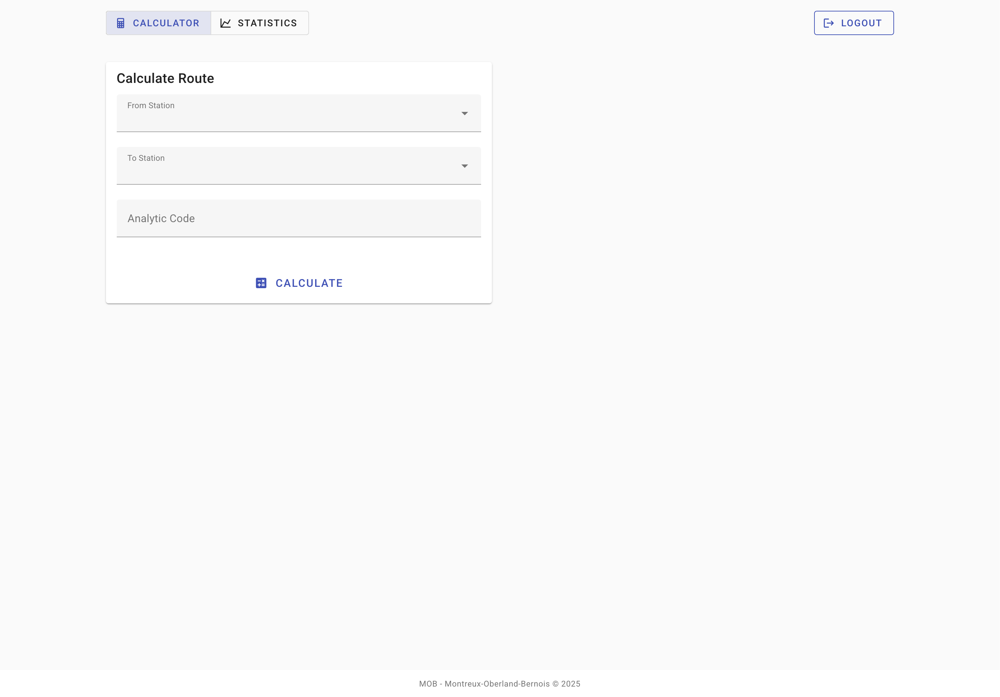
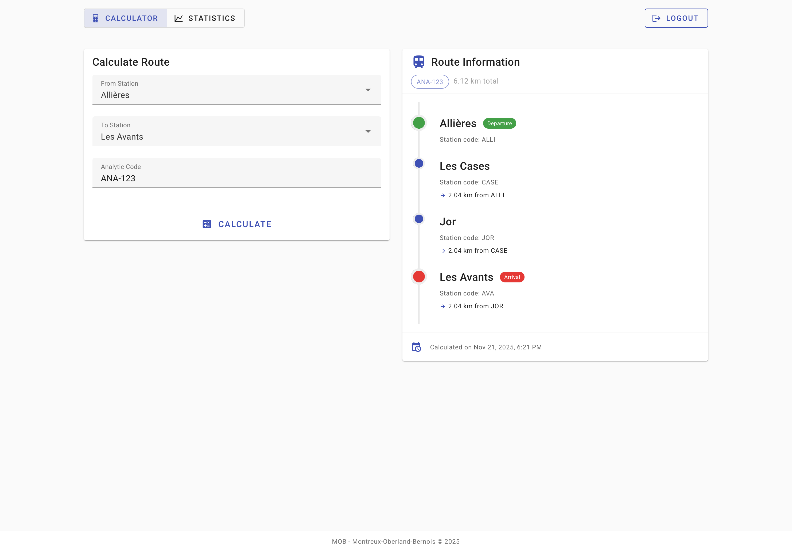
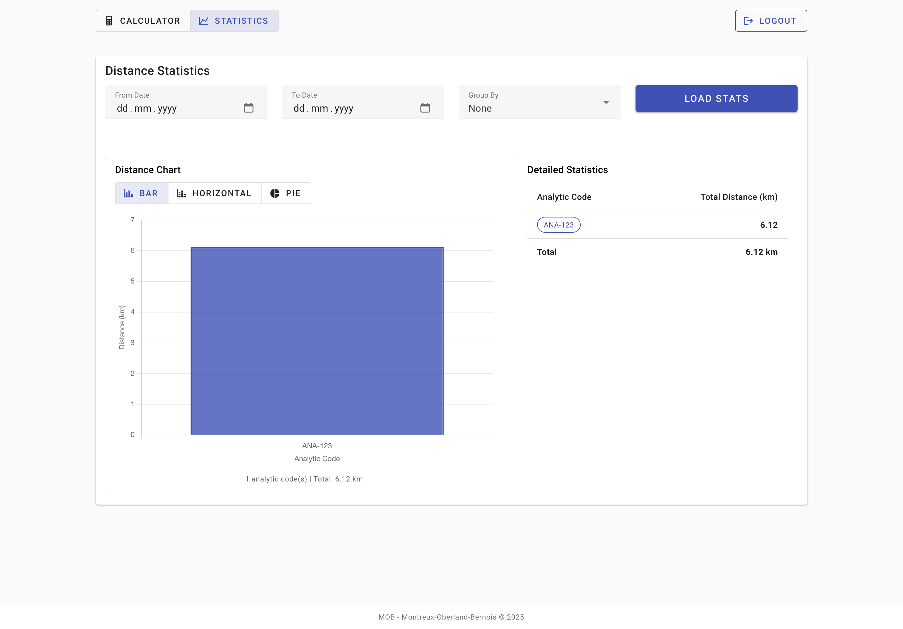

# DeFi Fullstack - Train Routing & Analytics

A railway traffic management system built with **PHP 8.4 (Symfony 7)** and **Vue.js 3 + Vuetify 3**. Calculate distances between train stations and analyze traffic statistics with a modern, secure, and containerized architecture.

---

## Quick Start

### Option 1: Using Makefile (Recommended)

The project includes a [Makefile](Makefile) with convenient commands for common tasks:

```bash
# Production setup (optimized, no hot reload)
make install

# Development setup (with hot reload)
make install-dev

# View all available commands
make help
```

> **Note**: SSL certificates and JWT keys are generated automatically on first run and reused on subsequent installations. Use `make certs-renew` or `make jwt-keys-renew` if you need to regenerate them (e.g., certificate expiry or key rotation).

### Option 2: Using Docker Compose directly

The project uses Docker Compose profiles to separate production and development environments:

| Profile | Description | Services |
|---------|-------------|----------|
| `prod` | Production mode | nginx, backend, frontend-builder (static build), db |
| `dev` | Development mode | nginx-dev, backend, frontend (hot reload), db |

```bash
# Production mode (optimized build, static frontend)
docker compose --profile prod up -d

# Development mode (hot reload for frontend)
docker compose --profile dev up -d
```

> **Note**: The profiles are mutually exclusive. Production uses static frontend files served by nginx, while development uses Vite dev server with hot module replacement.

### Access the Application

- **Frontend**: https://localhost (or configured domain)
- **Backend API**: https://localhost/api
- **API Documentation**: See [docs/openapi.yml](docs/openapi.yml)

---

## Screenshots

### Route Calculator
Calculate the shortest path between two stations using Dijkstra's algorithm:



### Route Results
View detailed route information with path and distance:



### Statistics & Analytics
Visualize aggregated distances with interactive charts and grouping options:



---

## Features

### Core Functionality
- **Route Calculation**: Calculate shortest path and distance between any two stations using Dijkstra algorithm
- **Multi-line Support**: Handle routes across MOB and MVR-ce rail networks with interconnections
- **Analytic Tracking**: Categorize journeys by analytic codes (freight, passenger, maintenance, etc.)

### Bonus Features
- **Statistics Aggregation**: View aggregated distances by analytic code
- **Time-based Filtering**: Filter statistics by date ranges
- **Grouping Options**: Group data by day, month, year, or no grouping
- **Visual Analytics**: Charts and tables for traffic analysis

---

## Architecture

This project follows **Domain-Driven Design (DDD)** principles with **Test-Driven Development (TDD)** practices.

### Tech Stack

| Layer | Technology | Purpose |
|-------|-----------|---------|
| **Backend** | PHP 8.4 + Symfony 7 | REST API with DDD architecture |
| **Frontend** | Vue.js 3 + Vuetify 3 + TypeScript | Modern SPA with Material Design |
| **Database** | PostgreSQL | Data persistence |
| **Web Server** | Nginx | Reverse proxy with HTTPS |
| **Container** | Docker + Docker Compose | Orchestration and deployment |
| **Testing** | PHPUnit + Vitest | Unit and integration tests |
| **Quality** | PHPCS + PHPStan + ESLint | Code standards and static analysis |

### Key Architectural Decisions

- **DDD Layering**: Clean separation between Domain, Application, and Infrastructure layers
- **Value Objects**: Type-safe primitives (StationId, Distance, AnalyticCode)
- **XML ORM Mapping**: Keep domain entities free from framework dependencies
- **JWT Authentication**: Secure API access with Bearer tokens
- **TDD Workflow**: Red-Green-Refactor cycle for all features

For detailed architecture documentation, see [directives/1-architecture.md](directives/1-architecture.md).

---

## Project Documentation

This project includes comprehensive development directives in the [directives/](directives/) folder:

| Directive | Description |
|-----------|-------------|
| [0-requirements.md](directives/0-requirements.md) | Business requirements, API specification, technical stack, and evaluation criteria |
| [1-architecture.md](directives/1-architecture.md) | Project structure, DDD/TDD principles, domain model, and implementation strategy |
| [2-infrastructure.md](directives/2-infrastructure.md) | Docker configuration, networking, volumes, and deployment instructions |
| [3-database.md](directives/3-database.md) | Database schema, migrations, seeding, and Doctrine configuration |
| [4-backend.md](directives/4-backend.md) | Symfony setup, routing, authentication, testing, and linting |
| [5-frontend.md](directives/5-frontend.md) | Vue.js structure, components, routing, API integration, and testing |
| [6-conventions.md](directives/6-conventions.md) | Commit messages, branch naming, code style, and documentation standards |
| [7-authentication.md](directives/7-authentication.md) | JWT implementation, token generation, and security configuration |

These directives serve as both **development guides** and **technical documentation** for the project.

---

## Development

### Prerequisites

- Docker Engine 25+
- Docker Compose
- Make (optional, but highly recommended for convenience)

### Makefile Commands

The [Makefile](Makefile) provides shortcuts for all common development tasks. Run `make help` to see all available commands:

```bash
# Setup
make install          # Production setup (optimized build)
make install-dev      # Development setup (hot reload enabled)
make certs           # Generate SSL certificates

# Docker operations
make start           # Start containers (production mode)
make start-dev       # Start containers (development mode)
make stop            # Stop all containers
make restart         # Restart containers (production)
make restart-dev     # Restart containers (development)
make logs            # Show all logs
make logs-backend    # Show backend logs only
make logs-frontend   # Show frontend logs only

# Testing
make test            # Run all tests (backend + frontend)
make test-backend    # Run backend tests only
make test-frontend   # Run frontend tests only
make coverage        # Generate coverage reports for both
make coverage-backend # Backend coverage report
make coverage-frontend # Frontend coverage report

# Code quality
make lint            # Lint all code
make lint-backend    # Lint backend (PHPCS + PHPStan)
make lint-frontend   # Lint frontend (ESLint)
make lint-fix        # Auto-fix linting issues

# Database
make db-migrate      # Run database migrations
make db-reset        # Reset database (WARNING: destroys data)
make db-shell        # Open PostgreSQL shell
make db-seed         # Seed database with test statistics data (usage: make db-seed COUNT=200)

# Build & Rebuild
make build           # Build images without cache
make rebuild         # Rebuild and restart (prod mode)
make rebuild-dev     # Rebuild and restart (dev mode)

# Utilities
make shell-backend   # Open backend container shell
make shell-frontend  # Open frontend container shell
make jwt-keys        # Generate JWT keypair
make jwt-token       # Generate JWT token for testing
make clean           # Remove containers, volumes, and generated files
```

### Important: Production vs Development Mode

**Production Mode** (`make install`):
- Frontend is **built once** into static files at image build time
- Changes to frontend code **require rebuilding**: `make rebuild`
- Optimized for performance, smaller bundle size
- Use for testing production builds

**Development Mode** (`make install-dev`):
- Frontend code is **mounted as a volume** with hot reload
- Changes are **instantly visible** without rebuilding
- Runs Vite dev server with HMR (Hot Module Replacement)
- Use for active development

**When you change code**:
```bash
# If in production mode, rebuild is required
make rebuild       # Cleans everything and runs `make install` from scratch

# If in dev mode, just save the file - changes are automatic
# No rebuild needed!
```

> **Note**: The `make rebuild` command completely cleans your environment (containers, volumes, networks, vendor folder) and runs `make install` from scratch. This guarantees you always have a fresh, working environment with the latest code.

### Manual Setup (without Make)

```bash
# Clone the repository
git clone <repository-url>
cd defi-fullstack

# Copy environment configuration
cp .env.example .env
cp backend/.env.example backend/.env

# Generate SSL certificates
openssl req -x509 -nodes -days 365 -newkey rsa:2048 \
  -keyout nginx/certs/server.key \
  -out nginx/certs/server.crt \
  -subj "/C=CH/ST=Vaud/L=Montreux/O=Dev/CN=localhost"

# Start all services (choose profile)
docker compose --profile prod up -d   # Production mode
# OR
docker compose --profile dev up -d    # Development mode with hot reload

# Install backend dependencies
docker compose exec backend composer install

# Install frontend dependencies
docker compose exec frontend npm install

# Generate JWT keys
docker compose exec backend php bin/console lexik:jwt:generate-keypair

# Run migrations
docker compose exec backend php bin/console doctrine:migrations:migrate

# View logs
docker compose logs -f
```

### Running Tests

```bash
# Using Makefile (recommended)
make test              # Run all tests
make coverage          # Generate coverage reports

# Or manually
docker compose exec backend ./vendor/bin/phpunit
docker compose exec frontend npm test
```

**Coverage Reports:**
- Coverage reports are generated locally in `backend/var/coverage/` and `frontend/coverage/`
- These folders are excluded from version control (see `.gitignore`)
- CI/CD pipeline generates and uploads coverage reports as artifacts
- Minimum coverage thresholds: **70%** for both backend and frontend
- View reports locally: Open `backend/var/coverage/index.html` or `frontend/coverage/index.html` in a browser after running `make coverage`

### Database Migrations

```bash
# Using Makefile
make db-migrate

# Or manually
docker compose exec backend php bin/console doctrine:migrations:migrate
docker compose exec backend php bin/console make:migration
```

### Seeding Test Data

For testing the statistics features, you can seed the database with realistic route data:

```bash
# Seed with 100 routes (default)
make db-seed

# Seed with custom number of routes
make db-seed COUNT=200
```

This command:
- Generates routes using the actual API (respects Dijkstra algorithm)
- Creates varied analytic codes (MOB, MVR-ce)
- Distributes route creation dates over the last 90 days
- Provides realistic data for testing statistics aggregation and visualization

---

## API Usage

### Authentication

All API endpoints require JWT Bearer token authentication:

```bash
# Obtain token (implementation specific)
export TOKEN="your-jwt-token"

# Use token in requests
curl -H "Authorization: Bearer $TOKEN" https://localhost/api/v1/routes
```

### Calculate Route

```bash
POST /api/v1/routes
Content-Type: application/json
Authorization: Bearer <token>

{
  "fromStationId": "MX",
  "toStationId": "ZW",
  "analyticCode": "ANA-123"
}
```

**Response:**
```json
{
  "id": "uuid",
  "fromStationId": "MX",
  "toStationId": "ZW",
  "analyticCode": "ANA-123",
  "distanceKm": 62.08,
  "path": ["MX", "CGE", "...", "ZW"],
  "createdAt": "2025-01-01T00:00:00Z"
}
```

### Get Statistics (Bonus)

```bash
GET /api/v1/stats/distances?from=2025-01-01&to=2025-12-31&groupBy=month
Authorization: Bearer <token>
```

For complete API documentation, see [docs/openapi.yml](docs/openapi.yml).

---

## CI/CD Pipeline

This project includes a complete CI/CD pipeline (GitHub Actions / GitLab CI):

1. **Build**: Backend and frontend Docker images
2. **Quality**: Linting, tests, and coverage thresholds
3. **Security**: Static analysis (PHPStan, npm audit, Trivy)
4. **Release**: Semantic versioning and changelog generation
5. **Delivery**: Push to container registry and automated deployment

See [.github/workflows/ci.yml](.github/workflows/ci.yml) for implementation details.

---

## Security

### Implemented Security Measures

- HTTPS (TLS 1.2/1.3) with Nginx
- JWT Bearer token authentication
- Secure HTTP headers (HSTS, CSP, X-Frame-Options, etc.)
- CORS configuration
- Secrets management (no .env in commits)
- Docker security best practices
- SAST/DAST scanning in CI pipeline

For detailed security implementation, see [directives/7-authentication.md](directives/7-authentication.md).

---

## Network Structure

### MOB Line
Main axis: **MX -> ZW** with branches to:
- **LENK** branch
- **IO** (Interlaken) branch

### MVR-ce Line
- **VV -> PLEI** connection
- **BLON -> CABY** connection

### Interconnection
Lines connect at **CABY** station (shared between MOB and MVR-ce).

---

## Contributing

This project follows strict development conventions:

- **Commit Messages**: Conventional Commits format (`type(scope): description`)
- **Branch Naming**: `type/short-description` format
- **Code Style**: PSR-12 (PHP), ESLint + Prettier (TypeScript)
- **Testing**: TDD approach with minimum 70% coverage (backend and frontend)
- **Code Review**: All changes require PR review and passing CI checks

See [directives/6-conventions.md](directives/6-conventions.md) for detailed guidelines.

---

## License

This project is part of a technical challenge. See repository details for licensing information.
